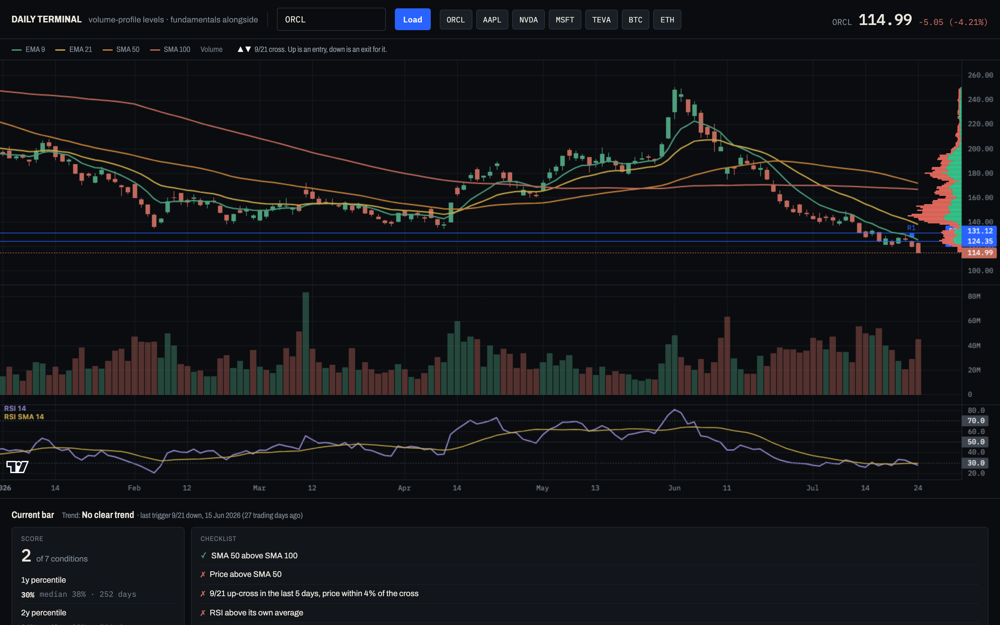
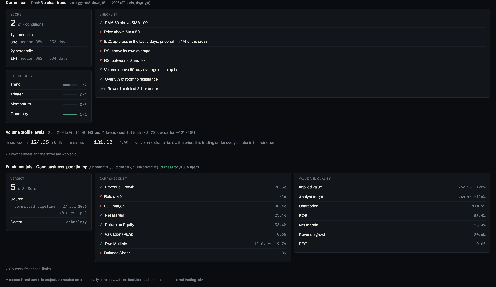

# Daily Terminal

[](https://github.com/barbarzilay100-coder/daily-terminal/actions/workflows/test.yml)

Daily technical research on any US stock, with the company's fundamental scorecard read
beside it. Support and resistance are computed from where volume actually traded, not
drawn by eye.

### ▶ [Open the live terminal](https://barbarzilay100-coder.github.io/daily-terminal/)

No sign-up and no API key. It is one HTML file and it fetches its own data.



Type a ticker and you get the chart with a fixed indicator set, deterministic support and
resistance derived from the volume-by-price histogram, a graded assessment of the current bar
against a defined checklist, and the company's GARP scorecard beside it.



Companion to [equity-research-terminal](https://github.com/barbarzilay100-coder/equity-research-terminal),
which supplies the fundamental layer. That project answers *whether a business is worth owning*;
this one answers *what the chart is doing now*. Each shows the other's read, so neither one gets
taken on its own.

Built by **Bar Barzilay**. [LinkedIn](https://www.linkedin.com/in/bar-barzilay-ba932235b) · [GitHub](https://github.com/barbarzilay100-coder) · [barbarzilay100@gmail.com](mailto:barbarzilay100@gmail.com)

## What it shows

**The chart.** Daily candles with a fixed moving-average ribbon (EMA 9 green, EMA 21 yellow,
SMA 50 orange, SMA 100 red), volume, and RSI 14 with its own 14-period average in a separate
pane. Drawn with [Lightweight Charts](https://github.com/tradingview/lightweight-charts),
TradingView's open-source library, over price data the page computes indicators from itself.

**Support and resistance from volume, not eyeballing.** Each day's volume is spread uniformly
across that day's high-low range, building a volume-by-price histogram. The contribution is
weighted by age, halving about every half trading year — holders turn over, and the price being
defended now is the one that moves price now — so a band nothing has traded near for a year
decays out of the profile on its own instead of standing until someone deletes it. Levels are
local peaks of that histogram that clear the mean bin, and peaks closer together than the
asset's own median daily range × 1.5 (held between 1% and 5%) count as one level, because a
fixed percentage asks a quiet utility and a fast crypto pair to call the same distance
"separate", which is two different claims about the market. The two nearest above the price are
resistance, the nearest below is support. They are drawn on the chart in blue and listed with
their distance from the price.

**The histogram is shown, not just used.** It sits against the price axis, so a bulge is at the
same height as the line it produced and a level can be read as the shape it came from rather than
taken on trust. Each bar is split by the direction of the day that supplied the volume — green
where that day closed above the one before it, red where it closed below — so the balance at a
level is visible too, and price sitting under the whole accumulation mass is something you see
rather than something the panel has to tell you. It is computed over whatever range is in view,
so it moves when you zoom, exactly as the levels do.

When price sits below every accumulation zone there is no support level, and the panel says so
rather than inventing one. Same when the window carries no volume at all, which is the case
where a mean of zero would otherwise let every bin qualify as a level.

**Entry and exit triggers.** An EMA 9 / EMA 21 cross, marked on the ribbon at the crossing
point. Long triggers only count while SMA 50 sits above SMA 100. The slow pair is a regime gate
and never an entry, because a golden cross fires long after the move has started. RSI and
volume are confirmation flags, never triggers, and a close through a volume level is tracked
separately because it is the one event that is not a moving-average derivative.

**A graded read of the current bar.** Eight conditions in four categories (trend context,
trigger freshness, momentum, geometry), scored X of Y applicable, with the full checklist
visible. There is deliberately no veto: a screen that rejects nearly every day carries no
information. Instead the score is placed against the asset's own history as a percentile over
both one and two years, against every bar strictly before today. A middling-looking score can
turn out to be unusually good for that name, or the reverse. Both windows are shown; if they
disagree, the regime changed.

`n/a` is reserved for conditions with genuinely no data, because an `n/a` leaves the denominator
and so flatters the score. A price at an all-time high has *unbounded* room to resistance, not
unmeasurable room, so it passes; and in the fundamental scorecard a negative PEG or negative
shareholder equity is a failure with a stated reason, not a missing value. One case is knowingly
left as `n/a`: with no accumulation band below the price there is no level to measure risk
against, so reward-to-risk is not scored. [The methodology](docs/METHODOLOGY.md#not-applicable-is-not-failure)
explains why that one is not treated the same as the resistance side.

**The fundamental layer.** The same eight-criterion GARP scorecard as the companion project,
with the same sector-applicability rules, plus implied value against price and analyst target.
For the 126 covered names it reads the committed pipeline output. For anything else it is
fetched live, and the panel labels which source it used and when that source was current. The
staleness horizons apply to both paths, including the pipeline's own build date. A frozen
pipeline stops being the primary source instead of quietly serving last quarter's multiples.

**Quality × timing.** One line joining the two: a quality business at a poor technical entry
reads differently from a weak one that happens to look good on the chart, and neither layer
says that alone.

## Reading one screen

The screenshots above are a single real read — ORCL on 24 July 2026 — and worth walking
through, because every claim on the screen can be checked against the panel next to it.

**The chart says why the score is low.** ORCL closed at 114.99, down 4.2%, under the whole
moving-average ribbon, and the last trigger was a 9/21 *down*-cross 27 trading days earlier.
The checklist agrees line by line: 2 of 7, with the regime gate still passing — SMA 50 has not
yet crossed under SMA 100 — and nearly everything else failing. The category bars show the
shape of the failure at a glance: momentum 0 of 3, trigger 0 of 1.

**The levels say where it is.** The visible window built its histogram from 140 bars and found
seven clusters, and price is under every one of them. So resistance reads 124.35 (+8.1%) and
131.12 (+14.0%), support does not exist, and the panel says exactly that instead of inventing a
floor. That absence is also why reward-to-risk is n/a rather than a free point: the room to
resistance is real and scores, but there is no level below to measure the risk half against.
The most recent break agrees with the direction — 23 July closed below 124.35.

**The percentile blocks the obvious shortcut.** 2 of 7 looks bad in the absolute; the
percentile says it really is bad *for ORCL*: 30th over one year, 26th over two, against a
median of 38%. When the two windows agree, the regime has not changed — this is an ordinary
weak day, not an unusual one.

**The fundamental panel is why the read is interesting at all.** 5 of 8 Solid, PEG 0.65,
implied value 128% above price, and the two independent price sources agreeing to 0.00%. The
joining line compresses it: good business, poor timing. Neither layer says that alone — the
chart alone reads "avoid", the scorecard alone reads "cheap quality" — and the point of the
terminal is that the sentence is produced by stated rules, on one screen, with the method one
click away.

## Skills demonstrated

| Feature | Skill it proves |
|---|---|
| Volume-profile support/resistance computed in-browser from OHLCV, age-weighted with volatility-scaled level separation | Quantitative method, not chart-reading by eye |
| Rolling historical scoring with an explicit no-look-ahead guarantee, tested across 25 sampled bars | Understanding of backtest bias, the error that invalidates most retail analysis |
| Regime gate / trigger / confirmation separated by design, with the redundant condition removed | Analytical thinking; knowing when two indicators say the same thing |
| Percentile context over two windows instead of a single hardcoded lookback | Parameter sensitivity shown rather than hidden |
| Two independent price sources reconciled and any gap flagged on screen | Reconciliation, accuracy, attention to detail |
| Staleness guard that rejects a real-but-four-year-old P/E, on both data paths | Data quality, the failure that silently corrupts a model |
| Bad-but-measurable values fail explicitly instead of dropping out of the denominator | Knowing that a lenient `n/a` flatters a score, and that a negative PEG satisfies `< 2` |
| Sector applicability recovered from SEC SIC codes when the primary source lacks it | Working with primary regulatory sources |
| GARP scorecard shared with the companion project, same thresholds | Financial statement analysis |
| 160-assertion end-to-end suite over recorded API fixtures, on a frozen clock in a pinned timezone | Testing and verification discipline, including the test that decays on its own |

## How it works

Everything is computed in the browser. There is no pipeline and no stored state.

**Prices.** `api.stockanalysis.com`, five years of daily OHLCV, keyless and CORS-open. The
chart opens on about seven months, which is as many daily candles as fit on one screen while
staying readable, and keeps the rest for zooming out.

**Indicators.** Computed in `index.html`: SMA, EMA seeded from a simple average, Wilder RSI
(the same smoothing TradingView uses), and the volume-by-price histogram. The chart library is
loaded from unpkg with an SRI hash; if it cannot be verified or fetched, the page says so instead
of failing silently to a blank screen.

**Fundamentals.** For the covered universe, the committed `data.json` of the companion project,
refreshed there by GitHub Actions every weekday. That pipeline is versioned and validated, so
it stays the primary source. Anything outside it is fetched from `stockanalysis.com`'s
timeseries API, one request per metric, with the sector recovered from the company's SIC code
via `data.sec.gov`. That API is undocumented, so it is used only to extend reach: if it stops
working, free-text lookups lose their fundamental panel and nothing else breaks.

Method, thresholds and every known limitation are documented in
[docs/METHODOLOGY.md](docs/METHODOLOGY.md).

## Run it

Open `index.html` in a browser. That is all. It is a single file and it fetches its own data.

## Tests

```bash
npm install playwright
npx playwright install chromium
node tests/e2e.cjs
```

160 assertions against recorded API responses, so the suite needs no network and does not change
as markets move. The clock is frozen to the recording date as well, because the staleness guard
reads `Date.now()`: with a live clock the fixtures rot, and the suite would start failing about a
month after recording with the source untouched. A test that decays on its own is worse than no
test, because it teaches you to ignore a red run.

The timezone is pinned to `Asia/Jerusalem` rather than left as the runner's, for the same reason:
date formatting is correct only in the zone you happened to test in, and a UTC runner hid a real
off-by-one day in the panel.

It checks the indicator maths against hand-rolled values, the volume-profile levels against a
golden run, the applicability rules on a real bank, the staleness guard on a real stale P/E and on
a stale pipeline snapshot, that a window with no volume produces no levels, that a failed load
leaves nothing of the previous symbol on screen, that a superseded load never paints over the one
that followed it, and every honest-empty state.

The assertion that matters most: twenty-five bars spread across the series are each scored twice.
Once with the full series present, once with the series truncated so that bar is the last one that
exists. Every pair has to match. That is what proves no future information leaks into a
historical score. One sample can agree by coincidence; twenty-five cannot.

## Stack

Vanilla JS · Lightweight Charts · stockanalysis.com · SEC EDGAR · Playwright
